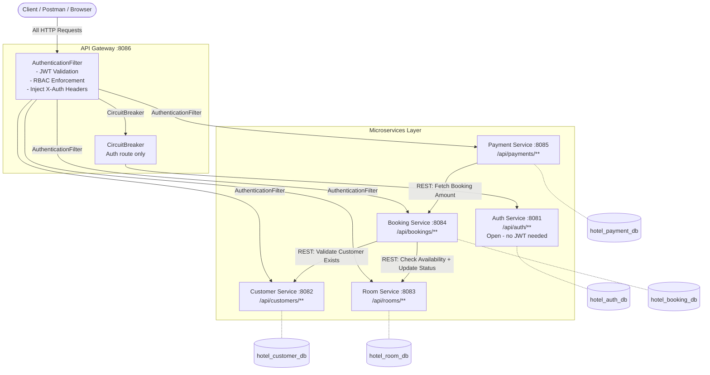
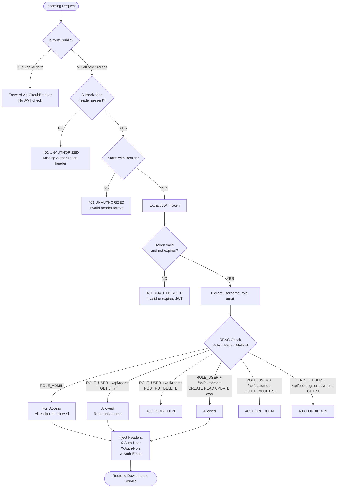
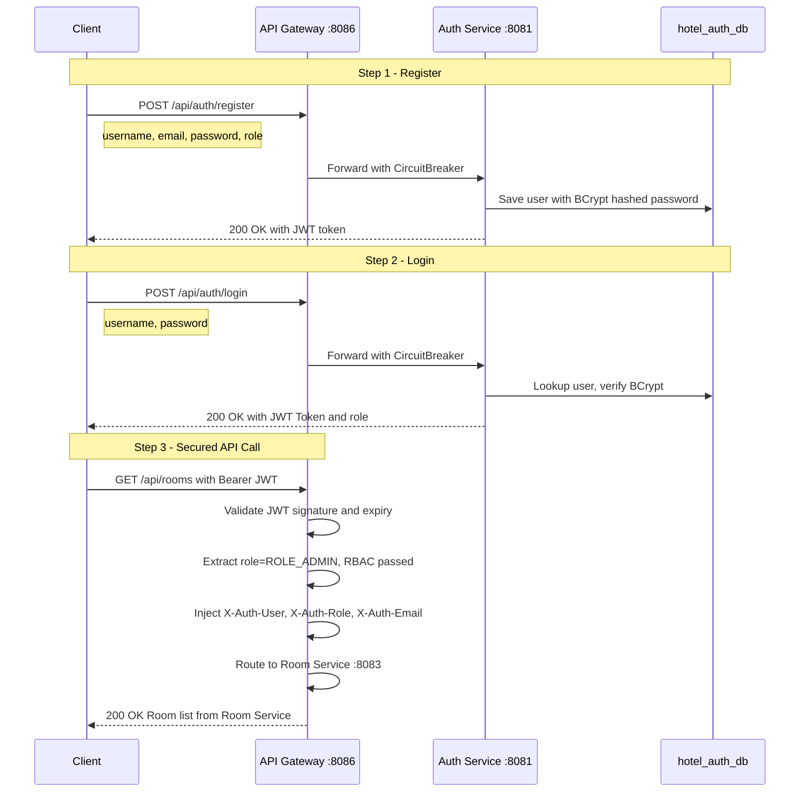
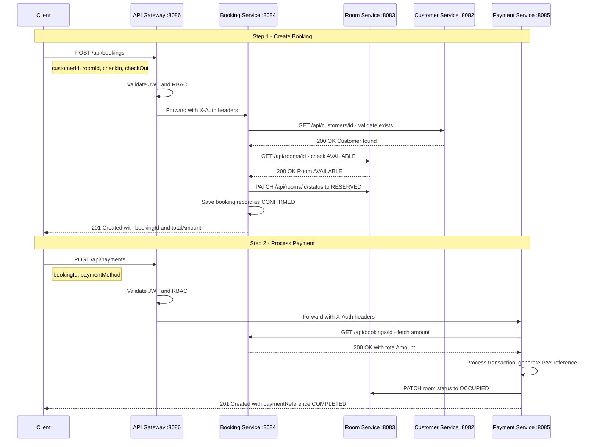
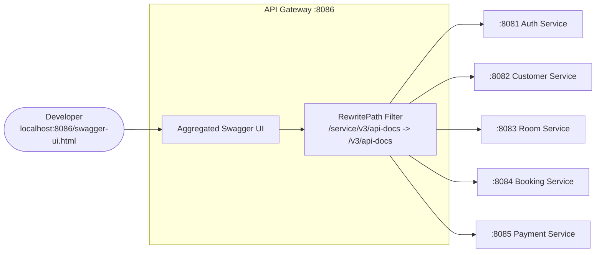

Slide 1 – Title
# Assignment 2 – Microservices Architecture

## Group Members

*   *[Add Group Member 1]*
*   *[Add Group Member 2]*
*   *[Add Group Member 3]*
*   *[Add Group Member 4]*

---
Slide 2 – Introduction
## Introduction

### What is Microservices Architecture?
Microservices architecture is a design approach where a single application is built as a suite of small, independently deployable services. Each service runs its own process, manages its own database, and communicates with other services through lightweight mechanisms like HTTP/REST APIs.

### Why the Hotel Booking Domain?
The Hotel Booking domain was chosen because it involves distinct, critical business operations (managing rooms, handling bookings, processing payments, and managing users). This makes it highly suitable for microservices, allowing for localized fault isolation, independent scaling (e.g., scaling the Booking or Room service during peak holiday seasons), and separation of concerns.

---
Slide 3 – System Architecture Diagram

## System Architecture Flow & Workflow Diagrams

### 1. Full Structural Architecture Diagram
Every service with its actual port, its dedicated database, the API Gateway as the single entry point, and the inter-service REST calls between microservices.

---

### 2. API Gateway Internal Flow (Authentication & RBAC)
What the `AuthenticationFilter` does inside the gateway for every incoming request. Based on actual `AuthenticationFilter.java`.

---

### 3. Login & JWT Token Workflow
Full sequence from user registration to making an authenticated API call.

---

### 4. End-to-End Booking & Payment Workflow
Full inter-service communication chain for a complete hotel booking transaction.

---

### 5. Swagger Aggregation Architecture
How the API Gateway exposes all microservice APIs under one unified Swagger UI at `http://localhost:8086/swagger-ui.html`.

> **Note:** The API Gateway acts as the single entry point for all workflows. It handles JWT validation, RBAC enforcement, and X-Auth header injection before routing to downstream services. Auth routes use a CircuitBreaker pattern for fault tolerance. Swagger UI aggregates all 5 microservice API docs into one page.

---
Slide 4–6 – Each Microservice
## Microservices Breakdown

### 1. Customer Service 
*   **Responsibility:** Manages customer profiles, personal details, and ownership of their specific data.
*   **Endpoints:** `/api/customers/**` (e.g., GET `/api/customers/{id}`)
*   **Database:** MySQL (`hotel_customer_db`)

### 2. Room Service
*   **Responsibility:** Manages hotel room catalog, room types, pricing, and availability status.
*   **Endpoints:** `/api/rooms/**` (e.g., GET `/api/rooms/available`)
*   **Database:** MySQL (`hotel_room_db`)

### 3. Booking Service
*   **Responsibility:** Handles the reservation lifecycle, checks room availability via inter-service communication, and creates booking records.
*   **Endpoints:** `/api/bookings/**` (e.g., POST `/api/bookings`)
*   **Database:** MySQL (`hotel_booking_db`)

### 4. Payment Service
*   **Responsibility:** Processes financial transactions linked to bookings and maintains payment statuses.
*   **Endpoints:** `/api/payments/**` (e.g., POST `/api/payments`)
*   **Database:** MySQL (`hotel_payment_db`)

### 5. Auth Service
*   **Responsibility:** Handles user registration, login, and issues JWT tokens containing user roles and identity claims.
*   **Endpoints:** `/api/auth/**` (e.g., POST `/api/auth/login`)
*   **Database:** MySQL (`hotel_auth_db`)

---
Slide 7 – API Gateway

## API Gateway

*   **Role:** Acts as the unified front door for the system. It handles routing, security (JWT token validation + RBAC via `AuthenticationFilter`), header injection, circuit breaking, and Swagger UI aggregation — so that individual services don't have to duplicate this logic.
*   **Routing Example:** 
  1. Client sends a request to `http://localhost:8086/api/bookings/1` with a Bearer Token.
  2. The API Gateway intercepts the request, validates the JWT, and enforces RBAC rules.
  3. If valid, injects `X-Auth-User`, `X-Auth-Role`, `X-Auth-Email` headers and routes the request to the internal Booking Service running on port `8084`.

---
Slide 8 – Swagger Screenshots
## Swagger Screenshots

*(Tip: Insert your actual screenshots below before finalizing your presentation!)*

### Direct Access
*Screenshot showing direct access to a specific microservice (e.g., Customer Service on port 8082).*
> ``

### Gateway Access
*Screenshot showing the aggregated API documentation accessible through the API Gateway, utilizing OpenAPI definitions from all routed services.*
> ``

---
Slide 9 – Conclusion
## Conclusion

Building the Hotel Booking System using a Microservices Architecture provides several tremendous advantages over a monolithic approach:
*   **Scalability:** Services experiencing high load (like Room Search or Booking) can be scaled horizontally independent of less frequently used services.
*   **Flexibility:** Different teams can utilize the best tool for the job. Services can easily be rewritten or upgraded without impacting the rest of the ecosystem.
*   **Independent Deployment:** A bug fix in the Payment Service only requires a redeployment of that specific service, ensuring minimal downtime and faster delivery times.

---

## Technologies Used

*   **Backend Framework:** Spring Boot (Java 17)
*   **API Gateway:** Spring Cloud Gateway
*   **API Documentation:** Swagger / OpenAPI 3.0
*   **Security:** Spring Security, JWT (JSON Web Tokens)
*   **Database:** MySQL (Database per service pattern)
*   **Build Tool:** Maven
